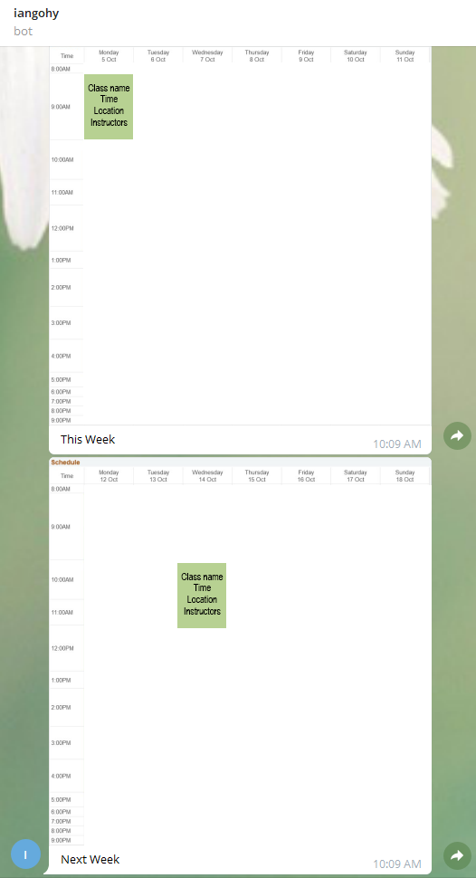

# SUTD MyPortal Timetable Telebot

Saves screenshot of timetable from MyPortal and sends it to user via Telegram bot for easy reference. Bot can get timetable for this week and next week.

Don't worry about your credentials being stolen as the code will only execute locally on your machine.

## Screenshots


## Installation Instructions
### Windows/Linux

Instructions below assume pip and python are already installed. If not you may refer [here](https://www.python.org/downloads/) or consult Google.
1. Download and install [Firefox browser](https://www.mozilla.org/en-US/firefox/new/)
2. Download latest version of [geckodriver](https://github.com/mozilla/geckodriver/releases)
3. Unzip downloaded folder and place geckodriver.exe into the root of this project folder (i.e. `.../myportal_timetable_telebot/geckodriver.exe`)
4. Install python requirements
    * Open a terminal window and run
```
pip3 install -r requirements.txt
```
5. Create .env file in the root of this project folder (i.e. `.../myportal_timetable_telebot/.env`)
```
myportal_user = "<this_is_my_student_id>"
myportal_pw = "<very_secure_password>"
api_key = "<crazy_long_telegram_api_key>"
chat_id = "<some_number>"
next_week = 1
gecko_path = "./geckodriver.exe"
```
6. Create Telegram bot
    * Search for BotFather (https://t.me/botfather) and talk to him
    * Use `/newbot` command to create a new bot
    * Choose a name and username for your bot (can be anything)
    * **IMPORTANT!** Copy the token given to you (the very long string)
    * For more details refer [here](https://core.telegram.org/bots#6-botfather)
7. Update .env file
    * You can edit this file using any text editor
    * Replace `<this_is_my_student_id>` with your student id
    * Replace `<very_secure_password>` with your password
    * Replace api_key with the very long token you got from botfather
    * If you are using **Linux**, change `gecko_path = "./geckodriver.exe"` to `gecko_path = "./geckodriver"`
8. Get chat_id
    * Search for your bot on telegram and send it a message (can be anything)
    * Open any browser and go to `https://api.telegram.org/bot<crazy_long_telegram_api_key>/getUpdates`, replacing <crazy_long_telegarm_api_key> with the token you got from BotFather
    * Look for something in this form 
    ```
    ..."chat":{"id":123456789,"first_name":"Trevor","username":"trevorling","type":"private"},"date":1602031969,"text":"hi"...
    ```
    * Copy the digits after `"id":`, which in this case is `123456789`
    * Update chat_id (replace <some_number>) in the `.env` file with this number
9. Done! You should be able to run the script using
```
python3 main.py
```

## Customising Configuration
### Receive only this week's timetable
* If you would like to only receive this week's timetable instead of both this and next week's you can remove the line `next_week = 1` in the `.env` file